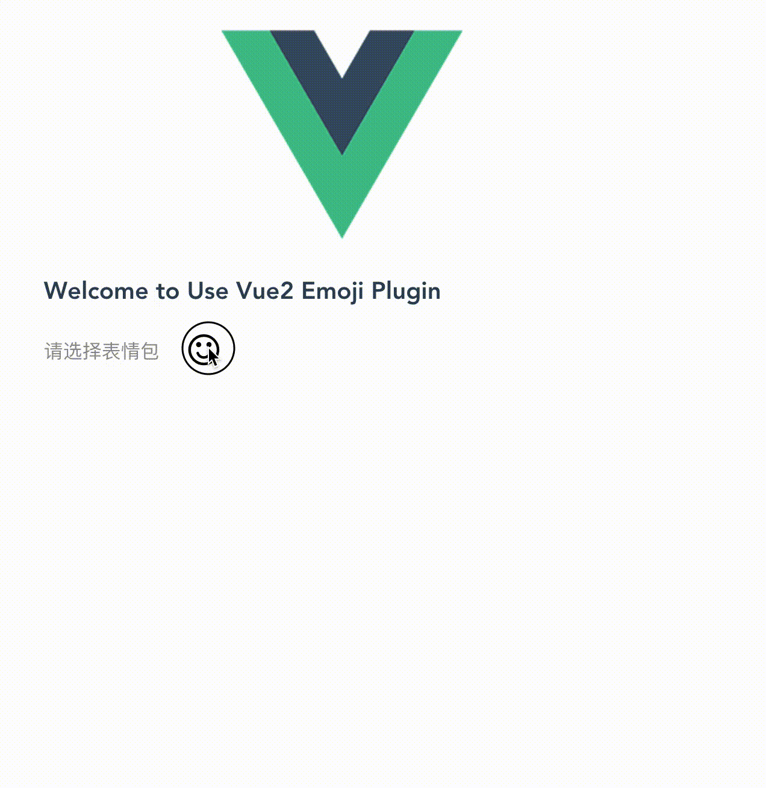

# vuejs-emoji for Vuejs 2.x
> Vue2.x emoji plugin and autoload fontawesome(^4.7.0) and bootstrap(^3.2.x)


## Install

``` bash
# install
$ npm install vuejs-emoji --save

```

## Requirement Dependencies
### 1、Vue-cli
* Vue-cli install
``` bash
# install
$ npm install -g vue-cli
```
* using cli create project
``` bash
$ vue init webpack my-project
```

[More Vue-cli docs](https://github.com/vuejs/vue-cli)

### 2、Emoji Resources Download


## Usage

### ES6

``` javascript
import Vue2Emoji from 'vue2-emoji'
Vue.use(Vue2Emoji)
```

### Using directive in template

``` html
<emoji-icon @select="selectIcon", :iconConfig="iconConfig"></emoji-icon>
```

### SelectCallback & IconConfig
* #### SelectCallback = selectIcon(val)
SelectCallback function's val is a html content.

``` html
<div v-html="val"></div>
```

* #### IconConfig is Object

``` js
  var iconConfig = {
    placement: 'top',
    size: '30px',
    name: 'fa-send', // font awesome icon name
    color: '#fff' // icon color: hex、rgb or rgba value
  }
```

[Font awesome website](http://fontawesome.io/icons/)

> Detail IconConfig

key | default | type | intro
--- | --- | --- |---|
placement| 'top' | String | 'top'、'left'、'right'、'bottom'|
size| '30px' | String | also can use rem, eg: '1rem'|
name| 'fa-smile-o'| String | just use font awesome icon name|
color| '#278dff' | String | can use hex、rgb、rgba value|

## Live Demo


## Screen Capture


## License
[MIT](https://opensource.org/licenses/MIT)
